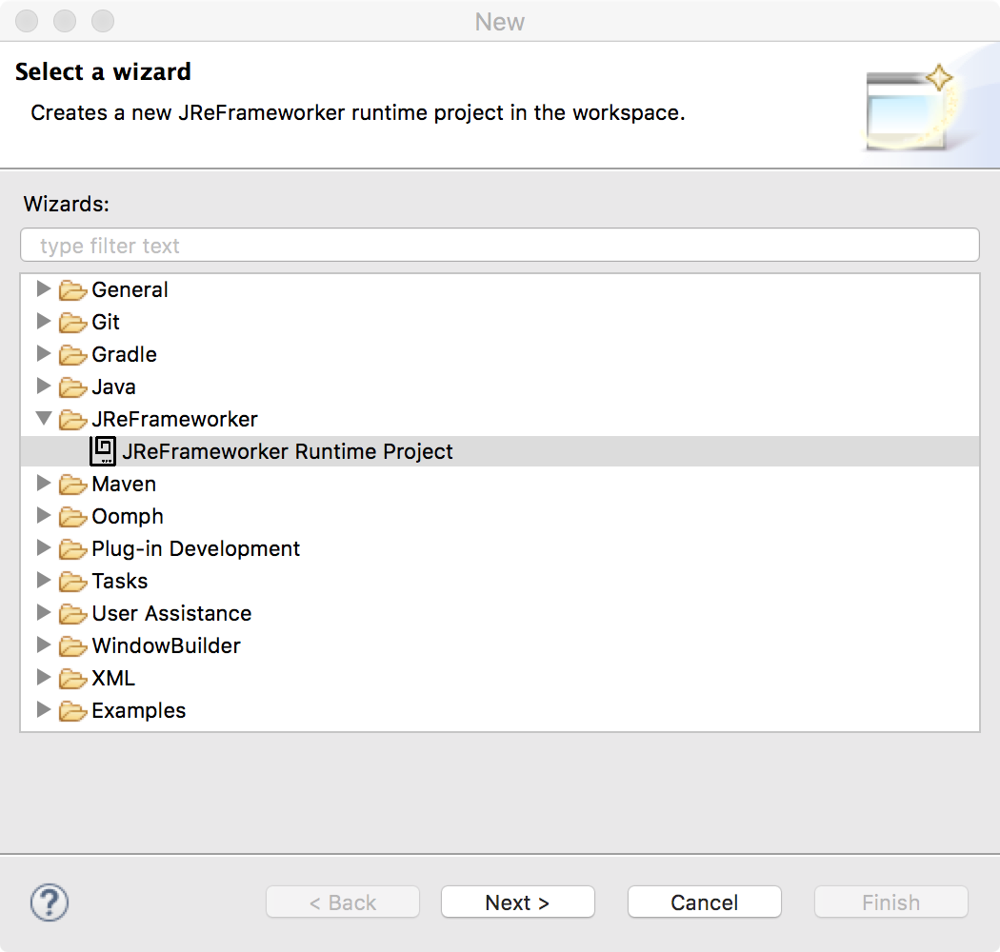
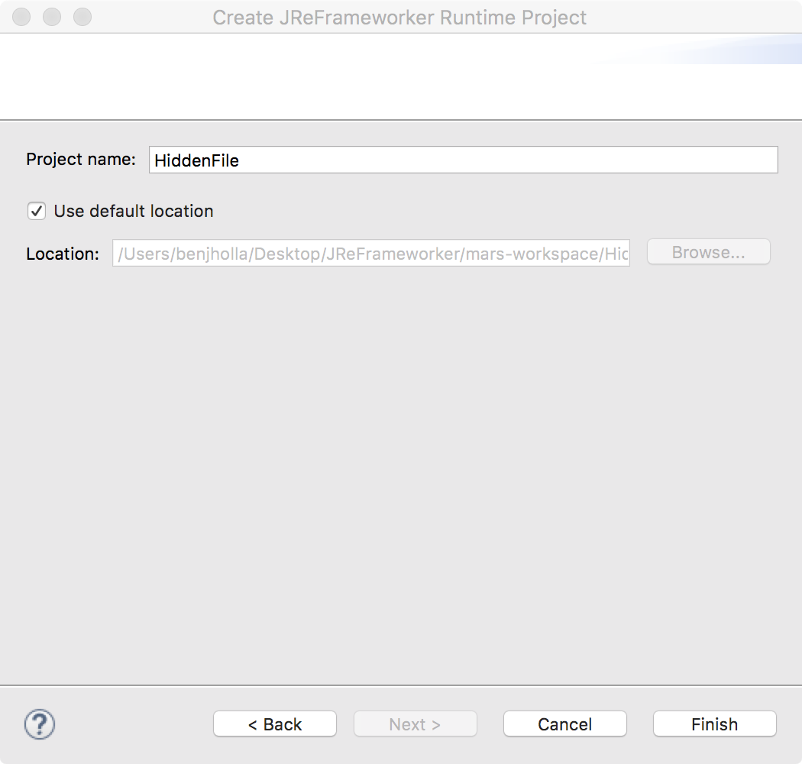
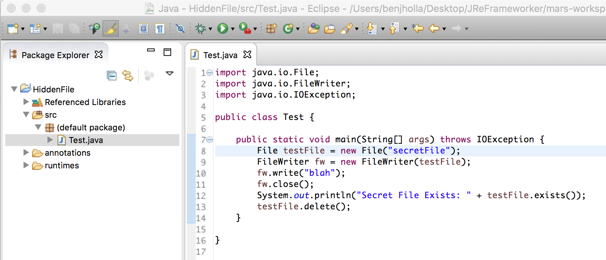
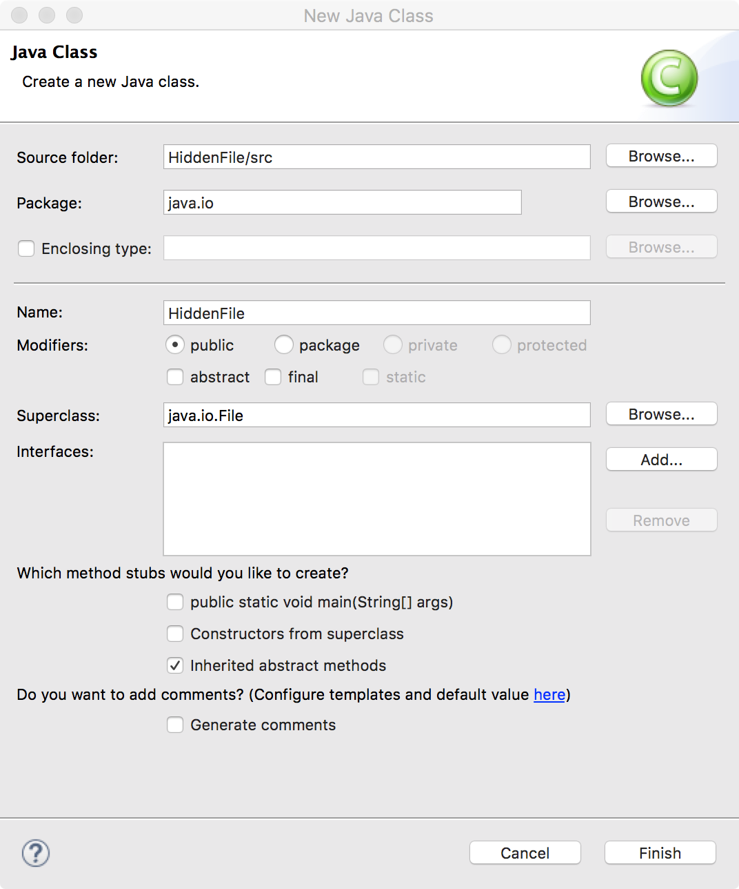
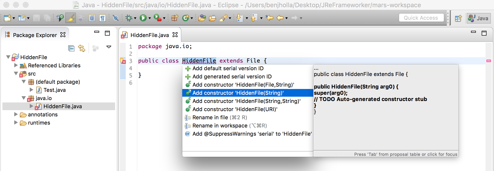
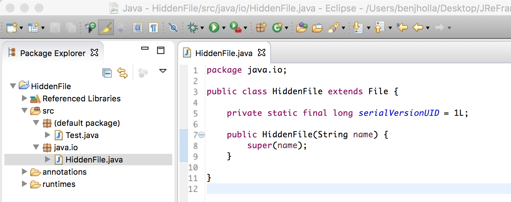
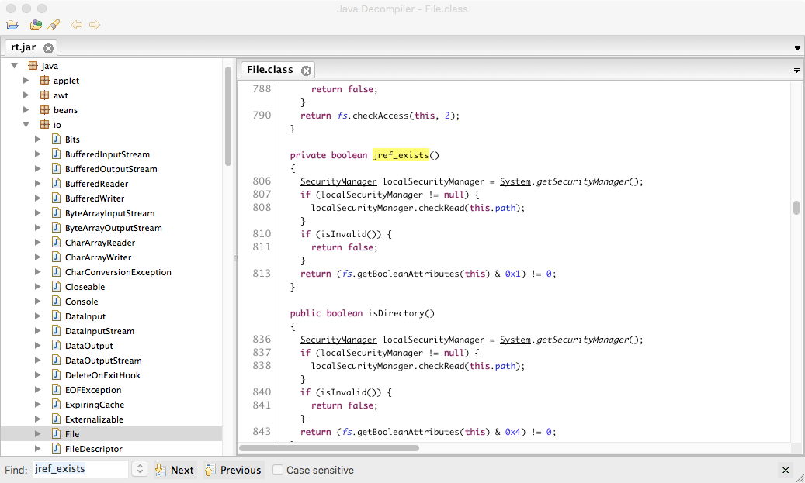
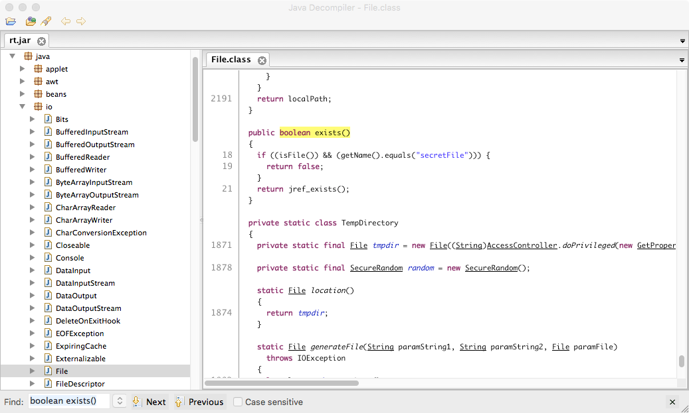
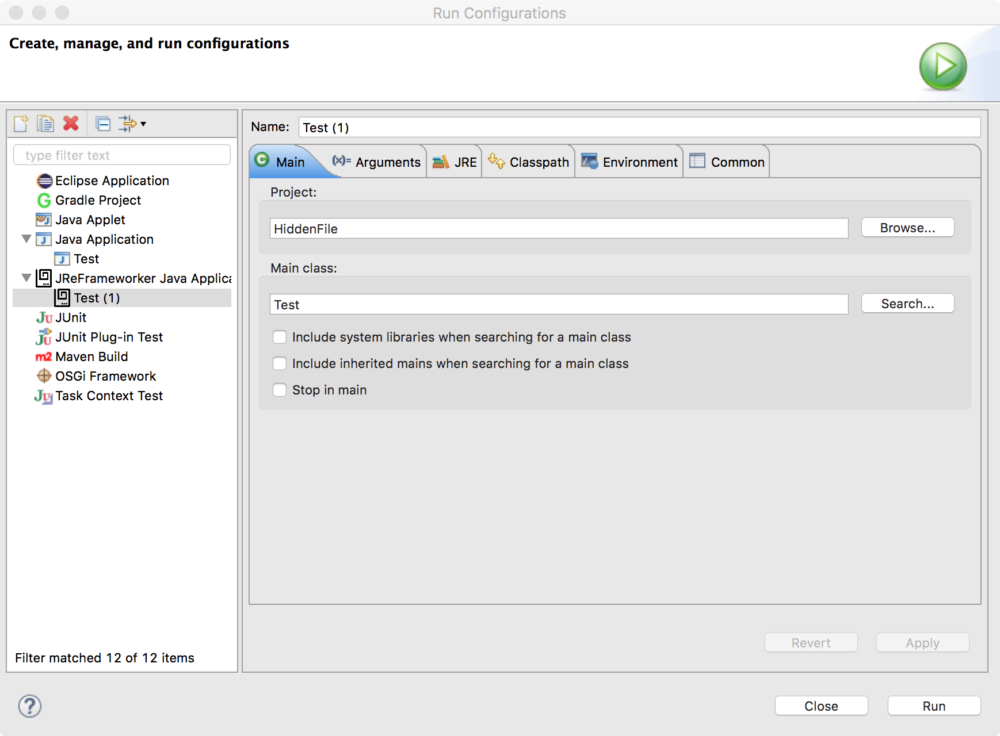

This extended introductory tutorial demonstrates how to create a simple attack module to hide a file using JReFrameworker and provides a basic understanding of the underlying bytecode manipulations performed by the tool.

At the end of the tutorial you will have created a module with JReFrameworker to modify the behavior of the Java runtime's `java.io.File` class to return false if the file name is "secretFile" regardless if the file actually exists or not.

## Creating a New Module

Each "module" consists of an Eclipse JReFrameworker project.  A module consists of annotated Java source code for one or more Java classes, which define how the runtime environment should be modified. A module may also contain test code that uses the runtime APIs that will be modified.  The test code can be used to execute and debug the module in the modified as well as original runtime environments.

To create a new attack module, navigate to `File` &gt; `New` &gt; `Other...` &gt; `JReFrameworker` &gt; `JReFrameworker Runtime Project`.

{: style="text-align: center"}

Enter a new project name for the module.

{: style="text-align: center"}

## Adding Test Logic

Next let's add some test code that will interact with the `java.io.File` API so that we can effectively test the modified runtime. The following `Test` class contains a main method that creates a `File` named "secretFile" and writes the string "blah" to the file.  After the file is written, the existence of the file is printed to the console.  Finally, the file is deleted.

	import java.io.File;
	import java.io.FileWriter;
	import java.io.IOException;
	
	public class Test {
	
		public static void main(String[] args) throws IOException {
			File testFile = new File("secretFile");
			FileWriter fw = new FileWriter(testFile);
			fw.write("blah");
			fw.close();
			System.out.println("Secret File Exists: " + testFile.exists());
			testFile.delete();
		}
	
	}
	
{: style="text-align: center"}

In an unmodified runtime, the print out should return "true" assuming the file could be written.  In the event that a file could not be written an exception will be thrown causing stack trace to be written to the output.

Our goal is to modify the runtime so that the print out reads "false" if the `File` object's name is "secretFile" regardless if the file actually exists on the file system, while maintaining the original functionality of the `File.exists()` method in all other cases.

## Prototyping Intended Behavior

Let's prototype a class that has the behavior we intend to modify the runtime with by developing the class as if we had control of the source code to the `File` class.  Since we are designing special case of `java.io.File` this a prime example of how Object Oriented languages can leveraged to make a subclass containing the desired behavior.

In this tutorial we will use the Eclipse New Class Wizard to create a subclass of `java.io.File`.  We create a class named `HiddenFile` that extends `java.io.File` in the package `java.io`.

{: style="text-align: center"}

Now because the `File` class does not have a default constructor, creating a subclass of `File` causes a compile error if we do not also create a `HiddenFile` constructor.  

{: style="text-align: center"}

In this tutorial we use Eclipse to resolve the compile error by generating a `HiddenFile` constructor.  Optionally, we can also use Eclipse to resolve the warning that `HiddenFile` does not declare a `serialVersionUID` field.

{: style="text-align: center"}

Now that we have created a subclass of `java.io.File` we can override the behavior of the `File.exists()` method with our desired functionality. First we can leverage the inherited `File.isFile()` and `File.getName()` methods to check if the `File` object is a file (and not a directory) and that the filename matches "secretFile".  If both conditions are true we can immediately return false.  Since we wish for the functionality of `HiddenFile.exists()` to behave normally in all other cases we can simply call `File.exists()` using the [super keyword](https://docs.oracle.com/javase/tutorial/java/IandI/super.html) to access the parent's method implementation.  After making these modifications we arrive at the following implementation for the `HiddenFile` class.

	package java.io;
	
	public class HiddenFile extends File {
	
		private static final long serialVersionUID = 1L;
	
		public HiddenFile(String name) {
			super(name);
		}
		
		@Override
		public boolean exists(){
			if(isFile() && getName().equals("secretFile")){
				return false;
			} else {
				return super.exists();
			}
		}
	
	}

Note that we use the source level annotation `@Override` here to ensure that the exists method is actually overriding `File.exists()`.  Source methods such as `@Override` do not get compiled into the resulting bytecode.

We can test the implementation of our prototype `HiddenFile` class by modifying our `Test` class code to instantiate a `File` object of type `HiddenFile`.  If the test logic does not produce the desired result, we can take this opportunity to set breakpoints in the `HiddenFile` class and debug it appropriately.

	import java.io.File;
	import java.io.FileWriter;
	import java.io.HiddenFile;
	import java.io.IOException;
	
	public class Test {
	
		public static void main(String[] args) throws IOException {
			File testFile = new HiddenFile("secretFile");
			FileWriter fw = new FileWriter(testFile);
			fw.write("blah");
			fw.close();
			System.out.println("Secret File Exists: " + testFile.exists());
			testFile.delete();
		}
	
	}
	
**Important Note:** The `java.io` package is a restricted package.  Running the test logic that includes a class extending a class in a restricted package will likely throw an exception depending on your current runtime security policy.

	Exception in thread "main" java.lang.SecurityException: Prohibited package name: java.io
	
If need be, this issue can be avoided by moving the `HiddenFile` class to a non-restricted package such as the default package or a new package such as `modules.java.io`.

## JReFrameworker Annotations

At this point we will take a short digression to examine the annotations provided by the JReFrameworker plugin.  Annotations are used to guide the behavior of JReFrameworker during the bytecode rewriting steps desired in a module. There are two primary classes of annotations: define and merge annotations.  For both classes of annotations there are three levels that annotations may be applied: type, method, and field.  The following matrix defines each supported annotation type.

|            | **Define**      | **Merge**       |
|------------|-----------------|-----------------|
| **Type**   | *@DefineType*   | *@MergeType*    |
| **Method** | *@DefineMethod* | *@MergeMethod*  |
| **Field**  | *@DefineField*  | N/A             |

 

| **Annotation&nbsp;Type** | **Description**                                                                                                                                                                                                                         |
|---------------------|-----------------------------------------------------------------------------------------------------------------------------------------------------------------------------------------------------------------------------------------|
| *@DefineType*       | Inserts or overwrites the class or interface into the runtime with the fields and methods of the current type.                                                                                                                          |
| *@DefineMethod*     | Inserts or overwrites the method into the runtime type. The current type must also be annotated with *@MergeType*.                                                                                                                      |
| *@DefineField*      | Inserts or overwrites the field into the runtime type.  The current type must also be annotated with *@MergeType*.                                                                                                                      |
| *@MergeType*        | Merges the fields and methods of the current type into the existing runtime type based on the field and method annotation types.                                                                                                        |
| *@MergeMethod*      | Replaces the method in the existing runtime type.  The original runtime method is renamed and made private.  Calls using the super keyword to the original method are replaced with dynamic invocations to the renamed original method. |

## Modifying the Runtime
As described in the previous section, annotations are used to guide the behavior of JReFrameworker during the bytecode rewriting steps desired in a module. This means that the steps of manipulating bytecode are completely abstracted away through the use of annotations.  To convert our `HiddenFile` prototype into a working module that rewrites the behavior of `java.io.File` we must carefully choose the annotations we wish to apply.

First we should consider the type level annotations. We want to maintain the original functionality of `java.io.File`, so we should not use the *@DefineType* annotation since it would overwrite the entire functionality of the original class.  This leaves us with the *@MergeType* annotation, which allows us to replace parts of the API while maintaining the original functionality of the original class.

The `HiddenFile` constructor and the `serialVersionUID` field were necessary for compiling and testing the `HiddenFile` functionality without warnings. The constructor and field are not needed for modifying the original `File` class however, so we will not annotate either the constructor or the field. JReFrameworker will ignore fields and methods that are not annotated when merging two types. 

This brings us to the `HiddenFile.exists()` method. Using *@DefineMethod* would be unwise here because it would completely replace the `File.exists()` method, which we are still depending on through our `super.exists()` method call!  Instead we should use the *@MergeMethod* annotation, which preserves the old `File.exists()` method by renaming and making the method private. Any calls to the original `File.exists()` method through *super* calls will automatically get replaced with calls to the renamed version of the original method.

After adding the appropriate annotation our `HiddenFile` implementation should look like the following.

	package java.io;
	
	import jreframeworker.annotations.methods.MergeMethod;
	import jreframeworker.annotations.types.MergeType;
	
	@MergeType
	public class HiddenFile extends File {
	
		private static final long serialVersionUID = 1L;
	
		public HiddenFile(String name) {
			super(name);
		}
		
		@MergeMethod
		@Override
		public boolean exists(){
			if(isFile() && getName().equals("secretFile")){
				return false;
			} else {
				return super.exists();
			}
		}
	
	}
	
For a merge, it is not important what package the subclass is in.  JReFrameworker will merge the annotated methods and fields of a class to merge into the parent class.  However, if we were defining (inserting or replacing) a runtime class the package would be important.
	
JReFrameworker implements a custom builder that automatically detects annotations and modifies the runtime appropriately. After pressing the save button you have effectively modified the runtime!

**Important Note:** Until incremental building support is implemented, you may have to perform a `Build` &gt; `Clean` operation from within Eclipse to trigger a fresh build of the runtime.

**Important Note:** Note that the modified runtime is only a local version of the runtime.  During development JReFrameworker does not replace your system's version of runtime libraries (as this would negatively effect Eclipse and would be essentially attacking the attacker...).  Steps to deploy the module to a victim's machine will be covered in a later tutorial.

## Understanding the Bytecode Manipulations
Let's digress one more time for a minute to take a look at the bytecode manipulations that were made by JReFrameworker.

The modified version of the runtime library is placed in the `runtimes` directory stored in the JReFrameworker project. Let's decompile the modified `rt.jar` runtime file using the free [JAD decompiler](http://jd.benow.ca/). Alternatively you may choose to use the free [Java Bytecode Viewer](https://bytecodeviewer.com/) to view both the decompiled source and the raw bytecode instructions.

Inspecting the modified version of `java.io.File` shows that the original `File.exists()` method was renamed to `jref_exists()` and made private as shown in the figure below. Note that the prefix used to renamed methods can be edited by changing the JReFrameworker preferences under `Eclipse` &gt; `Preferences...` (or `Window` &gt; `Preferences...`) &gt; `JReFrameworker`.

{: style="text-align: center"}

Inspecting the new version of `java.io.File` reveals that the new `File.exists()` method first calls `File.isFile()` and then `File.getName()` to check if the `File` is a file (and not a directory) and that the filename equals "secretFile".  If both conditions are true, then the boolean value of false is returned immediately. Otherwise the value of `File.jref_exists()` is returned.

{: style="text-align: center"}

Note that if we inspect at the bytecode level, we would find that special invocations through *super* calls are replaced with dynamic invocations and all instruction owners have been remapped from the subclass type to the base class type where applicable. 

## Testing the Modified Runtime

Before we begin testing, we should remember to revert our test logic back to the original test so we avoid calling any versions of the locally implemented `HiddenFile` functionality.

	import java.io.File;
	import java.io.FileWriter;
	import java.io.IOException;
	
	public class Test {
	
		public static void main(String[] args) throws IOException {
			File testFile = new File("secretFile");
			FileWriter fw = new FileWriter(testFile);
			fw.write("blah");
			fw.close();
			System.out.println("Secret File Exists: " + testFile.exists());
			testFile.delete();
		}
	
	}
	
Now that our test logic is using whatever implementation of `java.io.File` exists in the runtime environment we can run it again as a standard Java application.  It should return true as is the normal expectation of the runtime. To run `Test` again with the modified runtime use the JReFrameworker *Run* or *Debug* launch profile as shown in the image below.

{: style="text-align: center"}

Running with either of these launch profiles runs `Test` in the modified runtime (located at `<project>/runtimes/rt.jar`).  If everything was done correctly, the test program should return false! We will cover the steps to deploy the module's bytecode manipulations on a victims machine in a later step.

At this point you can save and share your module with others by right clicking on the project and navigating to `Export...` &gt; `General` &gt; `Archive File` and saving the project as an archive file.

You can download the module created during this tutorial at [https://github.com/JReFrameworker/modules/tree/master/HiddenFile](https://github.com/JReFrameworker/modules/tree/master/HiddenFile).
