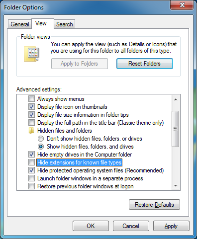

This tutorial demonstrates how to modify a victim machine's runtime using a JReFrameworker module.

If you haven't already, you should complete the first two tutorials ([Hello World](./hello-world) and [Hidden File](./hidden-file)) to become familiar with the basics of JReFrameworker.

## Lab Setup

You will also need to setup a small laboratory test environment that includes the following.

1. A victim machine (this tutorial uses a fresh install of Windows 7 SP1 x64 English edition in a virtual machine, but any OS capable of running Java will work).
2. An attacker machine with [Metasploit](https://www.metasploit.com/) installed (this tutorial uses a [Kali Linux virtual machine](https://www.offensive-security.com/kali-linux-vmware-virtualbox-image-download/) version 2016.2).
3. An installation of JReFrameworker (this tutorial uses the host machine, but any OS that can run [Eclipse](https://eclipse.org/) with JReFrameworker installed will work).

For this tutorial we will be using [VMWare](https://www.vmware.com) virtual machines with our victim at `192.168.1.2` and our attacker at `192.168.1.3`. [Virtualbox](https://www.virtualbox.org) is a good free alternative to VMWare.

Our victim machine was created with an Administrator account named "Victim" and password "badpass". Since Java is not installed by default, we will need to install the runtime environment. Log into the machine. Using the [ninite.com](https://ninite.com/) installer is an easy way to install the latest version of Java (in this case Java 8) as well as a few other tools that might come in handy later (7-Zip and Notepad++). Optionally you might also want to show file extensions and unhide hidden files. Navigate to the Start button and type "folder options" in the search bar. Under view select "Show hidden files, folders, and drives" and uncheck "Hide extensions for know file types".

The next section continues the lab setup to get an active [Metasploit Meterpreter](https://www.offensive-security.com/metasploit-unleashed/about-meterpreter/) session on the victim machine. If your lab setup is different and you have a working exploit already, skip to the [Post Exploitation](#PostExploitation) section below.

## Exploitation

## Post Exploitation